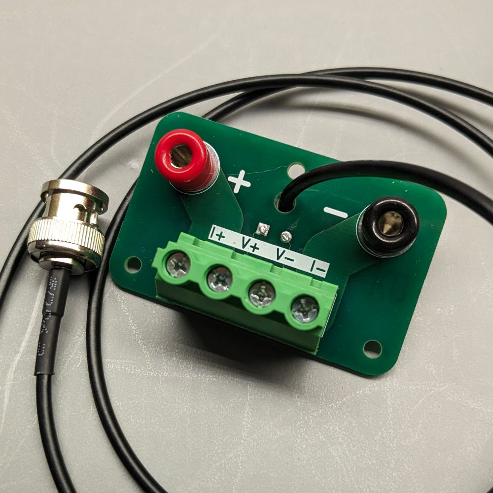

A PCB to adapt an ATorch-style load breakout board to be compatible with other electronic loads.

These breakouts are cheap and extremely convenient. But they have an unusual interface.

## BOM

- 7.62 pitch, 4 pin terminal block (for example, DORABO DB910-7.62-4P-GN-S)
- 1 meter BNC cable (75/50Ω doesn't matter, other end doesn't matter) or other 2-pin cable for voltage sense
- 1x red, 1x black banana jack

## Fabrication

Grab the latest gerbers from the releases in the side panel ->

## Assembly

A dab of hot glue is used on the rear as additional strain release for the voltage sense.

## Compatible devices

- [ATORCH data line test board is suitable for use with DL24 DL24MP DL24EW electronic load](https://www.aliexpress.us/item/3256805006520885.html)
- [ABS 4-wire and 2-wire Terminal 18650 26650 14505 14340 1425 battery Case Holder test Storage box for DL24P](https://www.aliexpress.us/item/3256801398816120.html)
